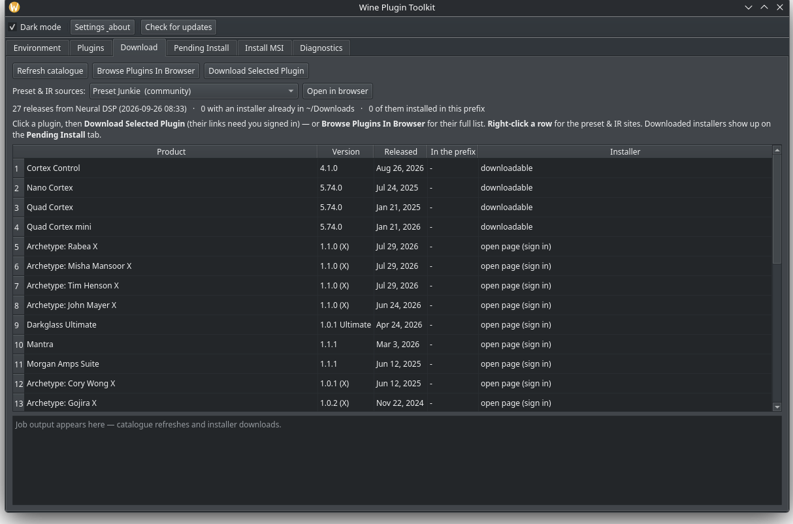

# Wine Plugin Toolkit (`wpt`)

[](https://github.com/Absolute-Projects-Public/wine-plugin-toolkit/releases/latest)
[](LICENSE)
[](https://www.python.org)
[](#install)

Install Windows audio plugins into an **ableton-linux** Wine prefix when the vendor's own installer
refuses to run, then prove afterwards that the files are really there.

**Status: 0.6.3. Early, and honest about it.** It is developed against one real stack (Neural DSP
plugins on CachyOS, Ableton Live 12 via [shibco/ableton-linux](https://github.com/shibco/ableton-linux))
and verified against real installers. Other vendors and other kinds of prefix are triaged read-only
rather than promised. Bug reports are welcome: `wpt doctor` prints most of what is needed for one.



## What it does

- **Installs** a plugin from the vendor's MSI, or from the vendor's `.exe` installer, by unpacking it
  with `msitools` and placing the payload itself.
- **Verifies** every file it placed against the MSI's own `File` table, size for size. Not "the
  installer exited 0": the numbers.
- **Repairs** only the files that are missing or the wrong size, from the MSI cached in the prefix.
- **Uninstalls** a product properly, rescuing your own presets and downloaded packs first.
- **Inventories** what is installed, and finds installs that registered but never copied their files.
- **Hides and restores** a plugin from your DAW's scanner without touching anything else.
- **Does not need Wine** for most vendor installers: 7-Zip, Inno, InstallShield, NSIS, Burn and CAB
  wrappers are unpacked on Linux. Wine is the fallback, not the first move.

## Why this exists

Vendor MSIs assume Windows in three ways Wine cannot satisfy:

1. a **bootstrapper-only launch condition**, like `SETUPEXEDIR OR (REMOVE="ALL")`, so `msiexec /i`
   cannot succeed (error **1603**);
2. **JScript custom actions** built on `Scripting.FileSystemObject` and `WScript.Shell`: Wine's stubs
   answer `Object doesn't support this action`, the install copies nothing (error **103**) and still
   registers the product as installed;
3. an invisible **maintenance dialog** on the upgrade path, which Wine never paints, so the installer
   waits forever.

`msitools` can read and unpack those same MSIs on Linux. This tool uses that to place the payload
directly and check it afterwards. The case that started it: an Archetype plugin upgrade where the
wrapper hung at *"Starting install"* with an empty progress bar, `msiexec` failed twice, and the prefix
claimed the product was installed while not one plugin file existed on disk.

## Requirements

- Linux, x86-64, Python 3.11 or newer
- `msitools` (the only hard dependency)
- A Wine prefix in the ableton-linux shape: `~/.wine-ableton` plus a staged
  `~/.local/opt/wine-d2d1-nspa-<version>` tree. If yours is elsewhere, every command takes
  `--prefix` and `--tree`
- `pyside6`, only if you want the GUI

```bash
# Arch / CachyOS
sudo pacman -S python msitools pyside6

# Debian / Ubuntu
sudo apt install python3 msitools python3-pyside6.qtwidgets
```

## Install

### Arch / CachyOS, from the release (recommended)

Every release attaches a built package and its checksum. Download both from the
[latest release](https://github.com/Absolute-Projects-Public/wine-plugin-toolkit/releases/latest),
check the download, then install it:

```bash
cd ~/Downloads
sha256sum -c wine-plugin-toolkit-*.pkg.tar.zst.sha256   # the checksum must match
sudo pacman -U wine-plugin-toolkit-*.pkg.tar.zst
```

That gives you `wpt` (command line) and `wpt-gui` (windowed), a desktop entry in your application
menu, and completions for fish, bash and zsh. `pacman` will pull in `python` and `msitools` for you.

Once installed, `wpt update` tells you when a newer release exists, and can download and install it
for you.

### Arch / CachyOS, from the source tarball

Same release page, take the `wpt-<version>.tar.gz` asset instead, and build it yourself (needs
`base-devel`):

```bash
tar xzf wpt-*.tar.gz && cd wine-plugin-toolkit-*/
makepkg -si
```

### Any other Linux, from source

This does not need to be packaged to work. From a checkout or an extracted tarball:

```bash
python3 -m venv .venv
.venv/bin/pip install '.[gui]'      # drop [gui] if you only want the CLI
.venv/bin/wpt env
```

Anything installed this way is a copy, so `wpt update` (which installs an Arch package) does not
apply to it. Update it the same way you installed it.

### Your first five minutes

```bash
wpt doctor          # can it see your Wine stack, msitools, your plugin dirs, and write a scratch dir?
wpt env             # what exactly did it find: tree, prefix, Windows user, every directory
wpt list            # what is actually installed in there, and is it intact
```

`doctor` says what to fix if something is missing, and exits non-zero so you can use it in a script.
If it cannot find your Wine stack, tell it where to look: `wpt --prefix ~/.wine-ableton --tree ~/.local/opt/wine-d2d1-nspa-11.13 doctor`.

## Coming from Windows

You paid for this software. None of it has to be re-bought to run here, and nothing about this tool
invalidates a licence: it moves files inside your own prefix, and that is all.

**What you need first.** A working ableton-linux install, which is what creates `~/.wine-ableton` and
the staged Wine build this tool looks for. That project is the one that makes Live itself run.
This tool sits next to it: ableton-linux tells you to install plugins by hand, by running the vendor's
`.exe` inside the prefix, which is exactly the step that hangs the whole time. This is the tool that
does that step properly.

**Your plugin installers.** Move the `.exe` and `.msi` files you downloaded on Windows into
`~/Downloads` on Linux (a USB stick or your network drive is fine). Then:

```bash
wpt pending         # what installers are sitting there, and are they installed already
wpt install ~/Downloads/ArchetypeNollyXv1.0.2.exe
```

`pending` guesses the product and version from the file name, and says whether that version is already
in the prefix. `install` reads the installer first, shows you exactly which files it would place, and
only then writes them. Add `--dry-run` to look without touching anything.

**Your own presets, sounds and MIDI maps.** These are the one thing a reinstall cycle cannot bring
back. Copy them off the Windows machine (usually `Documents\Neural DSP\...`, or wherever you saved
your own sounds) into the prefix, or keep them somewhere safe on this machine, then:

```bash
wpt presets                                     # what is in the prefix now
wpt presets --export ~/Documents/my-presets     # copy it all out to a plain folder
```

Factory and artist presets come back with a reinstall. Yours do not, so back them up before you
uninstall anything. `wpt uninstall` also copies your own presets out of the way before it removes
files, and tells you where it put them, unless you pass `--no-rescue`.

**Activation and iLok.** Some vendors use iLok (PACE) or an account-based licence. The toolkit
does not touch licensing, and deleting plugin files never returns a licence slot. If a plugin was
activated on a prefix you are retiring, deactivate it in iLok License Manager first. If that location
is already broken or unreachable, use *Report as Unusable* there so the slot comes back. This trips
people up, so it is repeated in the uninstall warning.

**Things that will not work here.**

- **Drivers.** Some downloads are drivers or helper applications, not plugins: Neural DSP's Nano
  Cortex package is a Windows USB driver plus a control panel. Those are refused by default, with the
  reason and the folder their files wanted. Placing a driver's files by hand does not install it
  because drivers need their INF and service registration.
- **Linux-native plugins.** This manages Windows plugins inside a Wine prefix. A Linux VST3 or CLAP
  belongs in your normal Linux plugin directories and has nothing to do with this.
- **macOS and Windows prefixes.** Out of scope.

## Command line

All of it is one CLI. Every command has `--help`, and `list` and `pending` take `--json` when you want
to paste machine-readable state into a bug report.

```bash
wpt doctor                  # check everything it needs, and say what is wrong
wpt env                     # tree, prefix, Windows user, every plugin directory
wpt list                    # inventory: what is installed, and is each file intact
wpt scan                    # installs that registered but never copied their files
wpt products                # triage every product in every Wine prefix on this machine
wpt pending                 # installers downloaded but not installed yet
wpt find-msi                # vendor MSIs already unpacked inside the prefix
wpt inspect <msi>           # identity, install targets, launch conditions, payload
wpt plan <msi>              # extract and show exactly what would be written
wpt install <msi> --dry-run # the same, with nothing touching the disk
wpt install <msi>           # do it, then verify byte sizes against the MSI
wpt install ~/Downloads/VendorSetup.exe   # or point it straight at the vendor's .exe
wpt repair --product Rabea  # re-place only the files that are missing or wrong-sized
wpt disable Nolly           # hide a plugin from the DAW scanner (a plain rename)
wpt enable Nolly            # bring it back
wpt uninstall --product X   # clear the registration and delete the files it placed
wpt wrappers                # identify every .exe installer around, and its route to an MSI
wpt presets                 # your presets and downloaded packs, and what has been rescued
```

`list` and `scan` are complementary. `list` walks the plugin directories and answers "what is there".
`scan` walks the prefix registry and answers "what do the installers claim is there". A plugin in
neither is not installed. A plugin that shows in `scan` but not `list` is the failure this tool was
written for: registered, with the files missing.

Useful flags, common to the commands that need them:

| flag | why |
|---|---|
| `--product <substring>` | pick an MSI from the prefix without typing the path (`--product Rabea`) |
| `--dry-run` | show every change, write nothing |
| `--no-vst2` / `--no-standalone` / `--no-presets` | skip parts you do not want |
| `--aax` | include the AAX plugin (Pro Tools only, off by default) |
| `--scratch <dir>` | where the payload is extracted (default `/tmp/wpt-extract`) |
| `--prefix`, `--tree`, `--user` | override detection |
| `--json` | machine-readable output, for a bug report |

Exit codes: `0` ok · `1` verification or scan found problems · `2` bad input · `3` environment not
found · `4` msitools error.

### The vendor's `.exe`, and the MSI inside it

Vendors ship a `.exe` whose real payload is an MSI, which is all this tool can read. `wpt install`
takes either, and gets from one to the other by the cheapest route that works:

1. it is already an MSI: use it;
2. the wrapper has been run before, so its MSI is already cached in the prefix: use that, run nothing;
3. an unpacker that suits the wrapper's format can pull an MSI out of it: done, no Wine;
4. otherwise it runs the vendor installer under Wine once (`--run-wrapper`, or the GUI asks first) and
   picks up the MSI that lands in the prefix.

**The wrapper's format decides which tool is tried**, and saying what a file is comes before spending
minutes on it:

```bash
wpt wrappers                              # every .exe installer around, and its route
wpt wrappers --file ~/Downloads/X.exe     # one file in detail
wpt wrappers --file ~/Downloads/X.exe --unpack   # actually unpack it and report
```

| family | how it is recognised | route |
|---|---|---|
| Advanced Installer (LZMA) | `Caphyon` / `Advanced Installer` | **Wine only**: no Linux tool reads it |
| NSIS | `\xEF\xBE\xAD\xDE` at offset 0 | `7z`, then `cabextract` |
| Inno Setup | `Inno Setup Setup Data`, `JR.Inno.Setup` | `innoextract`, then `7z` |
| InstallShield | `InstallShield`, `setup.inx`, `data1.cab` | `unshield`, `7z`, `cabextract` |
| WiX Burn bundle | `WixBundle` / `wixburn` | `7z`, then `cabextract` (the payload is an appended cabinet) |
| 7-Zip self-extractor | the `7z` signature | `7z` |
| IExpress / CAB self-extractor | `IExpress`, `MSCF` | `cabextract`, then `7z` |
| anything unrecognised | nothing matches | every installed unpacker, in turn |

Two details that make this work on real files rather than tidy ones:

- **containers are found by content, not by name.** A Burn bundle hands its payload over as members
  called `a0` to `a13`, and a self-extractor as `[0]`, so `*.cab` and `*.msi` are not the search: the
  cabinet magic (`MSCF`) and the MSI magic (an OLE compound document) are. Verified on
  `vc_redist.x64.exe`, whose `a10` is read by msitools as *Microsoft Visual C++ 2022 X64 Additional
  Runtime*.
- **architecture is chosen deliberately.** Wrappers that carry every architecture (`arm64/`, `x86/`,
  `x64/`, same file name inside each) default to x64, and a wrapper named `...-win-x86` never resolves
  to the bigger x64 MSI just because it is bigger. Where a wrapper holds several MSIs, the one used is
  named and the rest are reported.

Neural DSP wrappers are Advanced Installer packages whose payload is an AI LZMA stream, which no Linux
tool can unpack (`7z` lists the PE and hands you a blob it cannot open). For those the Wine step is
what actually works, and the tool says so instead of leaving you guessing: a wrapper identified as that
family is refused immediately, with the reason.

**Not every vendor download is a plugin.** Drivers and helper applications are refused by default,
with the reason and the destination their files wanted:

```
wpt install "~/Downloads/NeuralDSP Nano Cortex v5.74.0.exe"
nothing a DAW can use: this package is an application or a driver, not a plugin.
  PFiles64 payload would go to .../Program Files/NeuralDSP/NeuralDSP Nano Cortex Driver v5.74.0
  Its own installer (or the vendor's .exe under Wine) is what installs it
  properly - drivers need their INF and service registration, which placing
  files by hand does not do. Pass --include-app-files to place them anyway.
```

Pass `--include-app-files` to have those placed anyway (byte-verified like everything else), knowing
no DAW will see them. A plugin package is unaffected by this rule: its own standalone app is still
installed.

### Plugins that come from a download page (Neural DSP)

```bash
wpt catalogue                 # every plugin they ship, current version, where it lives
wpt catalogue --open-page      # open their full downloads list, every plugin's page in one view
wpt catalogue --refresh        # re-read their page (otherwise a bundled snapshot is used)
wpt catalogue --open nolly     # open one plugin's download page in your browser
wpt catalogue --download "Cortex Control"   # public CDN links only (hardware and manuals)
```

**Why it opens a page instead of downloading for you:** the plugin links are behind a sign-in and are
licence-bound, so nothing outside your browser can fetch them. The hardware and manual links are
public, and `--download` does fetch those.

### Presets and IRs

```bash
wpt presets                                     # yours, the packs, and what has been rescued
wpt presets --export ~/Documents/my-presets     # copy them all out to a plain folder
wpt presets --sources                           # where to get more: repositories, vaults, shops
wpt presets --open "Preset Junkie" --product "Nolly X"
```

**Presets are the one thing an install or uninstall cycle cannot bring back.** Factory and artist
presets come back with a reinstall. Your own (`<product>/User/*.xml`), downloaded packs
(`<vendor>/<vendor>/<Pack> Presets/`) and hand-made MIDI maps do not. So `uninstall` copies every
irreplaceable preset to `~/.local/share/wpt/presets/<product>/<timestamp>/` **before** it removes
anything, without overwriting what is already there, and tells you the count and destination.
`--no-rescue` turns that off, and it is how people lose work.

The toolkit does not fetch presets from the internet, deliberately: the community repositories want a
sign-in, one vault sits behind a bot filter, and the shops want money. What it does is open the right
page in **your** browser, pre-filled with the plugin you are looking at. Where a site's search URL
could not be verified, no search parameter is invented: you get the front page.

### Updates

```bash
wpt update                # is there a newer release? (cached for a day)
wpt update --install      # download it, verify it, then print the pacman line
wpt update --install run  # ...and open a terminal to install it, then reopen the app
```

The GUI checks quietly at startup, keeps the answer for a day, and puts **Check for updates** in its
toolbar. Installing always happens in a visible terminal running `sudo pacman -U`, which means the app
closes first so pacman can replace its own files, then reopens when the install finishes. It never
escalates privileges on its own. Downloads are checked against the release's published sha256 when
there is one, and refused unless the file really is a pacman package. `WPT_NO_UPDATE_CHECK=1` turns
the startup check off, and "Skip this version" silences one release.

### When something is wrong

```bash
wpt doctor              # tree, prefix, permissions, tools, cached MSIs, inventory, GUI
wpt doctor --json       # the same, machine-readable: paste this into a bug report
```

It checks the things that actually break this kind of tool: a Wine tree that is not the staged one,
`msitools` missing, a plugin directory that is not writable, no cached MSI to verify sizes against, a
scratch directory it cannot write to, PySide6 absent. Each check says what to do about it, and the
exit code is usable from a script: **2** for something that must be fixed, **1** for optional things
missing, **0** for clean.

| symptom | what it usually means |
|---|---|
| `env` cannot find a Wine tree | no staged `~/.local/opt/wine-d2d1-nspa-*`, or yours is elsewhere: pass `--tree` |
| a plugin reads `unverified` | the MSI for it is not cached in the prefix, so there is no size to compare. Repair and uninstall need that MSI |
| the vendor `.exe` hangs at "Starting install" | expected for Advanced Installer wrappers: it is a Wine limitation, and `wpt wrappers --file X.exe` will say so before you spend the time |
| an install reports 0 destinations | the package is an application or a driver, not a plugin. The log says which |
| the GUI will not start | `pyside6` is not installed (`wpt doctor` says so), or you are on a headless session |
| a plugin vanished from your DAW | check the Plugins tab for a `disabled` state, or `wpt list`: `disable` is a rename, and `wpt enable` undoes it |

### Shell completions

```bash
wpt completions fish > ~/.config/fish/completions/wpt.fish
wpt completions bash | sudo tee /usr/share/bash-completion/completions/wpt
wpt completions zsh  | sudo tee /usr/share/zsh/site-functions/_wpt
```

Generated from the real argument parser, so they cannot drift as commands are added. The Arch package
installs all three.

## GUI

```bash
wpt-gui            # or: python3 -m wpt.gui
```

Six tabs, in the order you use them, each a thin wrapper over the same core functions as the CLI:

- **Environment**: the detected tree, prefix, Windows user and plugin directories; warns if msitools is
  missing.
- **Plugins**: the inventory. Kind, size, and an integrity verdict against the cached MSI (`ok`,
  `unverified`, `BROKEN`), plus a **State** column for disabled plugins. The buttons act on the
  selected row: *Repair selected from cached MSI*, *Disable (hide from DAW)* or *Enable*, *Uninstall*.
  Right-click a row for the same actions plus the file's path and this plugin's preset sites.
- **Download**: Neural DSP's catalogue, with version, release date, whether it is installed here and
  whether an installer is already in `~/Downloads`. *Download Selected Plugin* opens its page in your
  browser; the *Preset & IR sources* row opens preset sites for the plugin you have selected.
- **Pending Install**: installers sitting in `~/Downloads` or the prefix root that are not installed
  yet, or are an upgrade. *Install selected* runs the same extract, place, verify as the CLI, one
  plugin at a time. This is the staging step: download on the previous tab, install on this one.
- **Install MSI**: pick or browse an MSI, choose VST3 / VST2 / standalone / presets, *Preview plan*
  then *Install*. A results table and a log, ending with the byte-for-byte verification.
- **Diagnostics**: scans the prefix registry for plugin paths that do not exist on disk, lists the
  products it registers (runtimes hidden), and *Triage products in every Wine prefix* reports what
  every prefix on the machine holds and which entries are debris.

Long operations run on a worker thread, so the window never freezes mid-extract. A plugin that is
disabled stays visible, flagged `disabled`, so it can always be brought back.

## How it verifies

This is the part worth trusting. Nothing here reports success because an installer said so:

- the **plan** comes from the MSI's own `File` table: exactly which files, to which directories, at
  which sizes;
- after writing, every file is **re-read and compared by size** with what the MSI says it should be;
- `BROKEN` in `list` means a file that exists at the wrong size, `unverified` means there was no MSI
  to compare against, and `ok` means both the file and its size agree;
- state is cross-checked two ways: the plugin directories (`list`) and the prefix registry (`scan`);
- `wpt doctor` checks the surrounding environment, and the GUI suites render and click through every
  tab offscreen before a release is built.

## Scope and limitations

- Verified end to end against **Neural DSP** installers (Advanced Installer and MSI) on a real
  `~/.wine-ableton` prefix: inventory sizes matched the MSIs, the scan reported zero missing paths, and
  `install --dry-run` reproduced the destinations that were previously placed by hand.
- **Wrapper families**: the Linux route is verified against real installers of each kind it claims: a
  7-Zip self-extractor (a Neural DSP hardware wrapper, MSI recovered and read by msitools), WiX Burn
  bundles (`vc_redist` and `dotnet-runtime`, with the right architecture chosen out of the appended
  cabinet), and Advanced Installer (correctly refused as Wine-only). Known gap: `innoextract` on a
  current Arch is older than the newest Inno Setup releases, so a brand-new Inno installer is
  identified but not opened. The tool says which version it could not read rather than pretending.
- `unshield` is used for InstallShield if it is installed, but it is not part of the base install.
  Without it, InstallShield wrappers fall through to `7z` and `cabextract`, and then to Wine.
- **Only files a plugin MSI describes count as plugins.** Wine's own tools (`iexplore.exe`,
  `wordpad.exe`, `wmplayer.exe`) and other vendors' helpers (Bonjour, iLok) sit in the same directories
  and are not. They are counted in one line of `list` output, and shown on request with
  `--all-standalone` (the GUI has a *show other .exe files* box). Same rule for the MSI picker.
- `scan`'s list of present paths can include a plugin's **support dlls** (Qt's `qwindows.dll` and
  friends live in plugin directories and are legitimate entries). They are not noise to filter
  blindly, just more entries than the four paths you may be looking for.
- **`uninstall` reads the MSI before it runs anything.** `msiexec /x` deletes Windows Installer's
  cached copy of the package, and on this stack that cache is often the only copy a product has
  (anything installed by running its vendor wrapper never writes one into its own folder), so the
  ProductCode, the File table and the plan are all taken **first**, and the MSI is copied out of reach.
  If it cannot be read at all, the command stops with nothing changed. Once msiexec has removed the
  registration and the cache, no MSI is left to describe the product: `wpt uninstall --product X` then
  says so and lists what the prefix still holds under that name, rather than pretending.
- `uninstall` removes a product two ways, because on this stack only one of them really works:
  `msiexec /x` clears the Windows Installer registration (usually a no-op, since none of these
  products are registered in the prefix), then **every file the MSI's File table placed** is deleted
  directly, with empty directories pruned and everything verified afterwards. `--no-files` stops after
  msiexec, `--files-only` skips it, `--purge` also removes the registry entries pointing at the
  deleted files, `--dry-run` lists every change first. Purging never frees an activation.
- **Which MSIs the tool can see.** Sizes are cross-checked against the MSIs cached inside the prefix: a
  vendor's own folder (`AppData/Roaming/Neural DSP/...`), `ProgramData/Package Cache`, and **Wine's
  Windows Installer cache** (`drive_c/windows/Installer/`). That last one matters, because a product
  installed by running its vendor wrapper may only leave its MSI there, and without finding it the
  plugin reads `unverified` and has nothing to repair or uninstall from. Only MSIs that **declare a
  plugin payload directory** (`VST3DIR`/`VSTDIR`/`AAXDIR`/`APPDIR`/`PREDIR`) are taken from that cache,
  so the prefix's runtimes (PACE, Wine Mono, Bonjour) neither slow the listing down nor show up as
  broken plugins.
- **The GUI runs one background job at a time.** A running job keeps its reference until it finishes, a
  second request is declined with a line in the log rather than queued, and closing the window waits for
  a running job. Each of those is a crash that was hit for real: Qt aborts the process, with no
  exception and no traceback, when a `QThread` that is still running loses its last reference.
- `--scratch` (where the MSI is unpacked, default `/tmp/wpt-extract`) is emptied before each
  extraction, because a plan is built by listing the extracted folders: stale payload from another
  product would otherwise be copied into the prefix on install, or deleted from it on uninstall. A
  scratch path that is not empty, was not created by wpt (no `.wpt-extract` marker) and sits outside
  the temp dir or `~/.cache` is refused rather than wiped.
- iLok is **diagnosed, not automated**: `scan` tells you a plugin is missing files, but licence slots
  are still checked by hand at <https://www.ilok.com>, under My Licenses.
- macOS, Windows, and prefixes that are not the ableton-linux shape are out of scope.

## Development

```bash
python3 tests/test_core.py                # pure logic, no prefix needed
python3 tests/test_prefix_integration.py  # builds a synthetic prefix and exercises everything
QT_QPA_PLATFORM=offscreen python3 tests/gui_smoke.py       # builds the GUI and runs every tab
QT_QPA_PLATFORM=offscreen python3 tests/gui_buttons_check.py  # clicks every button offscreen
```

`test_core.py` covers Wine tree version ordering, `.reg` value decoding (including UTF-16 `str(2)`
blobs), Windows to Linux path mapping, plugin-path classification, destination resolution from MSI
directory properties, and the CLI surface. `test_prefix_integration.py` builds a fake `~/.wine-ableton`
with a fake tree, plugin folders and a registry that mixes present and missing paths, then checks
detection, the inventory, the diagnostics scan, the repair filter and plan application against each
other. Neither needs msitools, a real installer or a real prefix.

```
wpt/environment.py   locate tree, prefix, user, directories; build the launcher environment
wpt/msi.py           msitools wrappers: identity, LaunchCondition, File table, msiextract
wpt/installer.py     build a copy plan, apply it, verify sizes, repair filter, uninstall, enable/disable
wpt/inventory.py     what is installed: walk plugin directories, cross-check sizes against cached MSIs
wpt/installers.py    what is not installed yet: installer discovery, name and version parsing
wpt/products.py      triage: every prefix walked, product records read, verdicts against the disk
wpt/presets.py       your presets and downloaded packs: list, export, rescue before removal
wpt/scan.py          registry against disk diagnostics, registration lookups for uninstall and purge
wpt/cli.py           argparse front end (every real behaviour lives in the modules above)
wpt/gui.py           PySide6 front end (no logic of its own)
packaging/           launchers, PKGBUILD helpers, desktop entry, icons
tests/               the suites listed above, plus wrapper corpus and GUI layout checks
```

One design rule holds the whole thing together: **no logic in the front ends.** If the GUI and the CLI
could ever disagree, the bug belongs in a core module.

## Credits

- [msitools](https://wiki.gnome.org/msitools) reads and unpacks the vendor MSIs.
- [shibco/ableton-linux](https://github.com/shibco/ableton-linux) is the Wine stack and prefix this
  target shape comes from.
- `7z`, `cabextract`, `innoextract` and `unshield` unpack the wrapper families listed above.
- Not affiliated with Ableton, Neural DSP, or any plugin vendor. Plugin names appear only to say what
  was tested.

MIT licensed. See [LICENSE](LICENSE) and [CHANGELOG.md](CHANGELOG.md).
