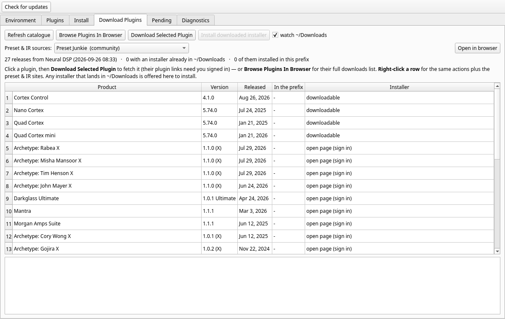

# Wine Plugin Toolkit (`wpt`)

**Status: 0.6.0 — early, and honest about it.** It is developed against one real
ableton-linux setup (Neural DSP plugins on CachyOS/Arch) and verified against real installers
there; other prefixes and vendors are triaged read-only rather than promised. Bug reports
welcome — `wpt doctor` (below) prints most of what is needed for one.




Install Windows audio plugins into an **ableton-linux** Wine prefix when the vendor's own installer
refuses to run — and prove afterwards that it actually worked.

Born from a real case: an Archetype plugin upgrade where the vendor wrapper hung at *"Starting
install"* with an empty progress bar, `msiexec` failed with **1603**, then **103**, and the prefix ended up
claiming the product was installed while not a single plugin file existed on disk.

## Why this exists

Vendor MSIs assume Windows in three ways Wine cannot satisfy:

1. a **bootstrapper-only launch condition** — `SETUPEXEDIR OR (REMOVE="ALL")`, so `msiexec /i` cannot
   succeed (1603);
2. **JScript custom actions** built on `Scripting.FileSystemObject` / `WScript.Shell` — Wine's stubs
   answer `Object doesn't support this action` and the install copies nothing (103), while still
   registering the product;
3. an invisible **maintenance dialog** on the upgrade path, which Wine never paints, so the installer
   waits forever.

`msitools` can read and unpack those same MSIs on Linux. This tool uses that to place the payload
directly, then checks every file against the MSI's own `File` table — byte size for byte size.

## Requirements

- Linux, Python 3.11+
- `msitools` — `sudo pacman -S msitools` (Arch/CachyOS) · `sudo apt install msitools` (Debian/Ubuntu)
- A Wine prefix of the ableton-linux shape (`~/.wine-ableton` + a staged
  `~/.local/opt/wine-d2d1-nspa-<version>` tree), or pass `--prefix` / `--tree`
- `pyside6` only for the GUI (`sudo pacman -S pyside6`)

## Command line

```bash
python3 -m wpt.cli doctor                  # check everything it needs, and say what is wrong
python3 -m wpt.cli env                     # what did it find: tree, prefix, user, dirs
python3 -m wpt.cli list                    # inventory: what is actually installed, and is it intact
python3 -m wpt.cli products                # triage every product in every Wine prefix on this machine
python3 -m wpt.cli presets                 # your presets and downloaded packs, and what has been rescued
python3 -m wpt.cli pending                 # installers downloaded but not installed yet
python3 -m wpt.cli find-msi                # vendor MSIs already unpacked inside the prefix
python3 -m wpt.cli inspect <msi>           # identity, install targets, launch conditions, payload
python3 -m wpt.cli plan <msi>              # extract + show exactly what would be written
python3 -m wpt.cli install <msi> --dry-run # same, but nothing touches the disk
python3 -m wpt.cli install <msi>           # do it, then verify byte sizes against the MSI
python3 -m wpt.cli repair --product Rabea  # re-place only the files that are missing or wrong-sized
python3 -m wpt.cli disable Nolly           # hide a plugin from the DAW scanner (rename, reversible)
python3 -m wpt.cli enable Nolly            # bring it back
python3 -m wpt.cli uninstall --product X   # remove a product: clear the registration + delete its files
python3 -m wpt.cli wrappers                # identify every .exe installer around, and its route to an MSI
python3 -m wpt.cli scan                    # find installs registered but missing from disk
```

`list` and `scan` are complementary: `list` walks the plugin directories (what is *there*), `scan` walks
the prefix registry (what the installers *claim* is there). A plugin that shows in neither is not
installed; one that shows in `scan` but not `list` is the Rabea failure — registered, files missing.

`list` and `pending` take `--json`, which is handy for pasting a machine-readable state report into a bug
thread. `pending` reads `~/Downloads` and the prefix root, guesses product and version from the file name
(`ArchetypeRabeaXv1.1.0.exe` → *Archetype Rabea X* 1.1.0), and reports whether that version is already
installed — so "what have I got lying around?" has an answer.

`disable`/`enable` are plain renames (`X.vst3` ↔ `X.vst3.disabled`). No registry edit, no uninstall,
exactly reversible — and the DAW's scanner simply stops seeing the file. `--dry-run` first if you like.

### Presets

```bash
python3 -m wpt.cli presets                       # yours, the packs, and what has been rescued
python3 -m wpt.cli presets --export ~/Documents/my-presets   # copy them all out to a plain folder
```

**Presets are the one thing an install/uninstall cycle cannot bring back.** Factory and artist presets
come back with a reinstall; your own (`<product>/User/*.xml`), downloaded packs
(`<vendor>/<vendor>/<Pack> Presets/`), and hand-made MIDI maps do not. So:

- `uninstall` copies every irreplaceable preset to `~/.local/share/wpt/presets/<product>/<timestamp>/`
  **before** it removes anything, no-clobber, and tells you the count and destination. `--no-rescue` turns
  that off — it is how people lose work.
- `wpt presets` reports what is where; `--export` copies the lot out to a folder you choose.

### Downloading plugins (Neural DSP)

```bash
python3 -m wpt.cli catalogue                 # every plugin they ship, current version, where it lives
python3 -m wpt.cli catalogue --open-page     # open neuraldsp.com/downloads — every plugin's page in one list
python3 -m wpt.cli catalogue --refresh       # re-read their page (else the bundled snapshot is used)
python3 -m wpt.cli catalogue --open "nolly"  # open that plugin's download page in your browser
python3 -m wpt.cli catalogue --download "Cortex Control"   # public CDN links only (hardware/manuals)
```

In the GUI that is the **Download Plugins** tab — click a plugin and press *Download Selected Plugin* (or *Browse Plugins In
Browser* for their full list), or **right-click a row** for the same actions plus the preset & IR sites, copy-name/path/link, and installing
whatever installer has already landed in `~/Downloads`. The list only redraws when the files in `~/Downloads`
actually change, so a refresh never steals the row you just clicked. Same thing: pick a plugin, *Open
download page* (it opens in your
browser), download it, and the tab notices it in `~/Downloads` and installs it for you — one plugin at a
time.

**Why the tool opens a page instead of downloading for you:** Neural DSP's plugin links require being signed
in and are licence-bound, so nothing outside your browser can fetch them. Hardware and manual links are
public, and those `wpt catalogue --download` does fetch.

### Vendor `.exe` installers (the MSI inside)

```bash
python3 -m wpt.cli install ~/Downloads/ArchetypeNollyXv1.0.2.exe --dry-run
python3 -m wpt.cli install ~/Downloads/ArchetypeNollyXv1.0.2.exe --run-wrapper
```

Vendors ship a `.exe` whose real payload is an MSI, which is all this tool can read. `wpt install` takes
either, and gets from one to the other by the cheapest route that works:

1. it is already an MSI — use it;
2. the wrapper has been run before, so its MSI is already cached in the prefix — use that, run nothing;
3. an unpacker that suits the wrapper's own format can pull an MSI out of it — done, no Wine;
4. otherwise it runs the vendor installer under Wine once (`--run-wrapper`, or the GUI asks first) and picks
   up the MSI that lands in the prefix.

**The wrapper's format decides which tool is tried**, and saying what a file is comes before spending
minutes on it:

```bash
python3 -m wpt.cli wrappers                              # every .exe installer around, and its route
python3 -m wpt.cli wrappers --file ~/Downloads/X.exe     # one file in detail
python3 -m wpt.cli wrappers --file ~/Downloads/X.exe --unpack   # actually unpack it and report
```

| family | how it is recognised | route |
|---|---|---|
| Advanced Installer (LZMA) | `Caphyon` / `Advanced Installer` | **Wine only** — no Linux tool reads it |
| NSIS | `\xEF\xBE\xAD\xDE` at offset 0 | `7z`, then `cabextract` |
| Inno Setup | `Inno Setup Setup Data`, `JR.Inno.Setup` | `innoextract`, then `7z` |
| InstallShield | `InstallShield`, `setup.inx`, `data1.cab` | `unshield`, `7z`, `cabextract` |
| WiX Burn bundle | `WixBundle` / `wixburn` | `7z`, then `cabextract` (payload is an appended cabinet) |
| 7-Zip self-extractor | the `7z` signature | `7z` |
| IExpress / CAB self-extractor | `IExpress`, `MSCF` | `cabextract`, then `7z` |
| anything unrecognised | — | every installed unpacker, in turn |

Two details that make this work on real files rather than tidy ones:

- **containers are found by content, not by name.** A Burn bundle hands its payload over as members called
  `a0`…`a13` and a self-extractor as `[0]`, so `*.cab` and `*.msi` are not the search — the cabinet magic
  (`MSCF`) and the MSI magic (OLE compound document) are. Verified on `vc_redist.x64.exe`, whose `a10`
  is read by msitools as *Microsoft Visual C++ 2022 X64 Additional Runtime*;
- **architecture is chosen deliberately.** Wrappers that carry every architecture (`arm64/`, `x86/`, `x64/`
  with the same file name inside each) default to x64, and a wrapper named `…-win-x86` never resolves to the
  bigger x64 MSI just because it is bigger. Where a wrapper holds several MSIs, the one used is named and
  the rest are reported.

**Not every vendor download is a plugin.** Some are drivers or applications — Neural DSP's Nano Cortex
package is a Windows USB driver (`.sys`/`.inf`/`.cat`) plus a control panel, with no VST3/VST2/AAX payload at
all. Those are refused by default, with the reason and the destination their files wanted:

```
wpt install ~/Downloads/NeuralDSP\ Nano\ Cortex\ v5.74.0.exe
nothing a DAW can use: this package is an application or a driver, not a plugin.
  PFiles64 payload would go to .../Program Files/NeuralDSP/NeuralDSP Nano Cortex Driver v5.74.0
  Its own installer (or the vendor's .exe under Wine) is what installs it
  properly - drivers need their INF and service registration, which placing
  files by hand does not do. Pass --include-app-files to place them anyway.
```

A driver/application's files can be placed with `--include-app-files` (byte-verified like anything else), but
no DAW will see them: they are not plugins. A *plugin* package is unaffected — its own standalone app is
still installed.

Neural DSP wrappers are Advanced Installer packages whose payload is an AI LZMA stream — no Linux tool can
unpack those (`7z` lists the PE and hands you a blob it cannot open), so for these the Wine step is what
actually works, and the tool says so rather than leaving you guessing. It also does not sit there trying:
a wrapper identified as that family is refused immediately.

### Updates

```bash
wpt update              # is there a newer release? (cached for a day)
wpt update --install    # download it, verify it, then show the pacman line
wpt update --install run  # ...and open a terminal to install it, then reopen the app
```

The GUI checks quietly at startup, keeps the answer for a day, and shows **Check for updates** in
its toolbar; when a newer release exists it offers to download it. Installing always happens in a
visible terminal (`sudo pacman -U …`) — the app closes first so pacman can replace its own files,
and reopens when the install finishes. It never escalates privileges on its own. Downloads are
checked against the release's published sha256 when there is one, and refused unless the file is
really a pacman package. `WPT_NO_UPDATE_CHECK=1` turns the startup check off; "Skip this version"
silences just that release.

### When something is wrong: `wpt doctor`

```bash
wpt doctor              # tree, prefix, permissions, tools, cached MSIs, inventory, GUI
wpt doctor --json       # the same, machine-readable - paste this into a bug report
```

It checks the things that actually break this kind of tool: a Wine tree that is not the staged
one, `msitools` missing, a plugin directory that is not writable, no cached MSI to verify sizes
against, a scratch directory it cannot write to, PySide6 absent. Each check says what to do about
it, and the exit code is usable from a script: **2** for something that must be fixed, **1** for
optional things missing, **0** for clean.

### Shell completions

```bash
wpt completions fish > ~/.config/fish/completions/wpt.fish
wpt completions bash | sudo tee /usr/share/bash-completion/completions/wpt
wpt completions zsh  | sudo tee /usr/share/zsh/site-functions/_wpt
```

Generated from the real argument parser, so they cannot go stale as commands are added. The Arch
package installs all three.

### Where to get more presets, IRs and tones

```bash
python3 -m wpt.cli presets --sources                             # the list, with what each one is
python3 -m wpt.cli presets --open "Preset Junkie"                 # open it in your browser
python3 -m wpt.cli presets --open "forum" --product "Nolly X"     # per-plugin search where it exists
```

The toolkit installs and repairs plugins; it does not fetch presets, and that is deliberate — the community
repositories want a sign-in, one vault sits behind a bot filter, and the shops want money. What it does is
open the right page in **your** browser, pre-filled with the plugin you are looking at. Six sources ship: the
Preset Junkie community repository, the Neural DSP forum's per-plugin preset threads (searchable per plugin),
Honest Amp Sims' free Preset Vault, the r/NeuralDSP sharing thread, and two paid pack shops. The GUI has the
same thing as a *Preset & IR sources* row in the Download Plugins tab. Where a site's search URL could not be
verified, no search parameter is invented — you get the front page.

### Sorting out a machine that has been through failed installs

```bash
python3 -m wpt.cli products                # every prefix, every product, with a verdict
python3 -m wpt.cli products --json         # same, machine-readable
python3 -m wpt.cli products --all-products # include runtimes and services
```

`products` reads **every** Wine prefix it can find — the target, `~/.wine`, Bottles bottles, Steam
`compatdata`, Heroic, Lutris — and reports what each one's registry claims, newest install first (from
the registry key's own write timestamp, not file mtime), cross-checked against the disk:

| verdict | meaning |
|---|---|
| `in use` | registered, and the files it points at are there — leave it alone |
| `files only` | plugin files with no registry record: placed by hand, or the record was cleared |
| `wrong prefix` | registered here, but its files are in another prefix |
| `fragment` | registered here and nothing on disk anywhere — a failed install |
| `registered` | recorded with no file evidence either way (runtimes, services) |

It also groups a product that appears in more than one prefix and marks which copy is live, then lists
what is worth a look before removing anything.

**Files can be deleted; activations cannot.** If a plugin was activated (iLok / PACE, or a vendor
account) and that prefix will not be used again, deleting the files does not return the licence slot:
deactivate it in iLok License Manager, or — if the location is unreachable or already broken — use
*Report as Unusable* there so the slot comes back.

Useful flags:

| flag | why |
|---|---|
| `--product <substring>` | pick an MSI from the prefix without typing the path (`--product Rabea`) |
| `--no-vst2` / `--no-standalone` / `--no-presets` | skip parts you don't want |
| `--aax` | include the AAX plugin (Pro Tools only — off by default) |
| `--scratch <dir>` | where the payload is extracted (default `/tmp/wpt-extract`) |
| `--prefix` / `--tree` / `--user` | override detection |

Exit codes: `0` ok · `1` verification or scan found problems · `2` bad input · `3` environment not found ·
`4` msitools error.

## GUI

```bash
python3 -m wpt.gui
```

Six tabs, all thin wrappers over the same core functions as the CLI:

- **Environment** — detected tree, prefix, Windows user, plugin directories; warns if msitools is missing
- **Plugins** — the inventory: kind, size, and an integrity verdict against the cached MSI (`ok` /
  `unverified` / `BROKEN`), plus a **State** column for disabled plugins. Buttons act on the selected
  row: *Repair selected from cached MSI*, *Disable (hide from DAW)* / *Enable*, *Uninstall…*
- **Install** — pick or browse an MSI, choose VST3/VST2/standalone/presets, *Preview plan* then *Install*;
  a results table and log, ending with the byte-for-byte verification
- **Pending** — installers sitting in `~/Downloads` or the prefix root that are not installed yet (or
  are an upgrade), with *Install selected* doing the same extract → place → verify as the CLI
- Both the **Plugins** and **Download Plugins** tables have a right-click menu with the same shape:
  repair/uninstall/enable-disable on one side, open-page/install/preset-sources on the other, plus copy
  actions (name, path, link) and *Show in file manager*.
- **Download Plugins** — Neural DSP's catalogue: version, release date, whether it is installed here,
  whether an installer is already in `~/Downloads`; *Open download page*, *Refresh catalogue*, a
  `watch ~/Downloads` checkbox, and *Install downloaded installer* (one at a time)
- **Diagnostics** — scans the prefix registry for plugin paths that do not exist on disk, lists the
  products it registers (runtimes hidden), and a *Triage products in every Wine prefix* button that
  reports what every prefix on the machine holds and which entries are debris

Long operations run on a worker thread, so the window never freezes mid-extract. A plugin that is
*disabled* stays visible here (flagged `disabled`), so it can always be brought back.

## Installing it

Arch/CachyOS — build once, install as `wpt`:

```bash
bash packaging/build-local.sh     # needs base-devel, for makepkg   # writes wine-plugin-toolkit-<ver>-1-any.pkg.tar.zst
sudo pacman -U wine-plugin-toolkit-*.pkg.tar.zst
wpt env          # CLI
wpt-gui          # GUI (needs pyside6)
```

Anything else, from the source directory:

```bash
python3 -m venv .venv && .venv/bin/pip install .            # console script `wpt`
python3 -m venv .venv && .venv/bin/pip install '.[gui]'     # adds `wpt-gui`
```

## Tests

```bash
python3 tests/test_core.py               # pure logic, no prefix needed
python3 tests/test_prefix_integration.py # builds a synthetic prefix, exercises everything
QT_QPA_PLATFORM=offscreen python3 tests/gui_smoke.py   # builds the GUI + runs every tab (needs PySide6)
```

`test_core.py` covers Wine tree version ordering, `.reg` value decoding (including UTF-16 `str(2)`
blobs), Windows→Linux path mapping, plugin-path classification, destination resolution from MSI
directory properties, and the CLI surface. `test_prefix_integration.py` builds a fake
`~/.wine-ableton` with a fake tree, plugin folders and a registry that mixes present and missing paths,
then checks detection, the inventory, the diagnostics scan, the repair filter and plan application
against each other. Neither needs msitools or a real installer.

## Layout

```
wpt/environment.py   locate tree/prefix/user/dirs; build the launcher env
wpt/msi.py           msitools wrappers: identity, LaunchCondition, File table, msiextract
wpt/installer.py     build a copy plan, apply it, verify sizes, repair filter, uninstall, enable/disable
wpt/inventory.py     what is installed: walk plugin dirs, cross-check sizes vs cached MSIs
wpt/installers.py    what is *not* installed yet: installer discovery + name/version parsing
wpt/products.py      triage: every prefix walked, product records read, verdicts vs the disk
wpt/presets.py       your presets and downloaded packs: list, export, and rescue before removal
wpt/scan.py          registry vs disk diagnostics + registration lookups for uninstall/purge
wpt/cli.py           argparse front end (all real behaviour lives in the modules above)
wpt/gui.py           PySide6 front end (no logic of its own)
packaging/wpt        launchers installed as /usr/bin/wpt and /usr/bin/wpt-gui
packaging/make-tarball.sh  build the PKGBUILD's source tarball (+ optional makepkg)
tests/test_core.py             pure-logic tests
tests/test_prefix_integration.py  synthetic prefix: detection, inventory, scan, repair, discovery, toggle
tests/gui_smoke.py             builds the GUI offscreen, runs every tab's core call
```

Design rule: **no logic in the front ends.** If the GUI and the CLI could ever disagree, the bug belongs
in a core module.

## Limitations / next steps

- Verified end-to-end against **Neural DSP** installers (Advanced Installer / MSI) on a real
  `~/.wine-ableton` prefix: inventory sizes matched the MSIs, the diagnostics scan reported zero missing
  paths, and `install --dry-run` reproduced the destinations that were previously placed by hand.
- **Wrapper families**: the Linux route is verified against real installers of each kind it claims —
  a 7-Zip self-extractor (a Neural DSP hardware wrapper, MSI out and read by msitools), WiX Burn bundles
  (`vc_redist` and `dotnet-runtime`, MSIs recovered from the appended cabinet with the right architecture),
  and Advanced Installer (correctly refused as Wine-only). `tests/wrapper_corpus.py` is the harness that
  checks this on a real machine. **Known gap:** `innoextract` on a current Arch is older than the newest
  Inno Setup releases, so a brand-new Inno installer is identified but not opened — the tool says which
  version it could not read rather than pretending.
- `unshield` is used for InstallShield if it is installed, but it is not part of the base install: without
  it, InstallShield wrappers fall through to `7z`/`cabextract` and, failing those, to Wine.
- **Only files a plugin MSI describes count as plugins.** Wine's own tools (`iexplore.exe`, `wordpad.exe`,
  `wmplayer.exe`) and other vendors' helpers (Bonjour, iLok) sit in the same directories and are not: they
  are counted in one line of `list` output and shown on request with `--all-standalone` (the GUI has a
  *show other .exe files* box). Same rule for the Install tab's MSI picker, so the prefix's runtimes are not
  offered as things to install.
- `scan`'s "plugins present" list can include a plugin's **support dlls** (Qt's `qwindows.dll` and
  friends live in plugin directories and are legitimate entries). They are not noise to be filtered
  blindly, just more than the four paths you may be looking for.
- macOS/Windows and non-ableton-linux prefixes are explicitly out of scope.
- **`uninstall` reads the MSI before it runs anything.** `msiexec /x` deletes Windows Installer's cached
  copy of the package, and on this stack that cache is often the only copy a product has (anything installed
  by running its vendor wrapper never writes one into its own folder), so the ProductCode, the File table and
  the plan are all taken **first** and the MSI is copied out of reach. If it cannot be read at all the
  command stops with nothing changed. Once msiexec has removed the registration *and* the cache, no MSI is
  left to describe the product: `wpt uninstall --product X` then says so and lists what the prefix still
  holds under that name, rather than pretending it can uninstall.
- `uninstall` removes a product two ways, because on this stack only one of them really works:
  `msiexec /x` clears the Windows Installer registration (usually a no-op — none of these products are
  registered in the prefix), then **every file the MSI's File table placed** is deleted directly, with
  empty directories pruned and everything verified afterwards. `--no-files` stops after msiexec,
  `--files-only` skips it, `--purge` also removes the registry entries pointing at the deleted files,
  `--dry-run` lists every change first. Purge never frees an activation — see above.
- **Which MSIs the tool can see.** Sizes are cross-checked against the MSIs cached inside the prefix: a
  vendor's own folder (`AppData/Roaming/Neural DSP/…`), `ProgramData/Package Cache`, and **Wine's Windows
  Installer cache** (`drive_c/windows/Installer/`). That last one matters — a product installed by running
  its vendor wrapper may only leave its MSI there, and without finding it the plugin reads `unverified` and
  has nothing to repair or uninstall from. Only MSIs that **declare a plugin payload directory**
  (`VST3DIR`/`VSTDIR`/`AAXDIR`/`APPDIR`/`PREDIR`) are taken from that cache, so the prefix's runtimes
  (PACE, Wine Mono, Bonjour) neither slow the listing down nor show up as broken plugins.
- **The GUI runs one background job at a time.** A running job keeps its reference until it finishes, a
  second request is declined with a line in the log rather than queued, and closing the window waits for a
  running job. Each of those is a crash that was hit for real: Qt aborts the process (no exception, no
  traceback) when a `QThread` that is still running loses its last reference.
- `--scratch` (where the MSI is unpacked, default `/tmp/wpt-extract`) is emptied before each extraction:
  a plan is built by listing the extracted folders, so stale payload from another product would otherwise
  be copied into the prefix on install, or deleted from it on uninstall. A scratch path that is not empty
  and was not created by wpt (no `.wpt-extract` marker) and sits outside the temp dir / `~/.cache` is
  refused rather than wiped.
- iLok is **diagnosed, not automated**: `scan` tells you a plugin is missing files, but licence slots are
  still checked by hand at <https://www.ilok.com> → My Licenses (`n/3`).